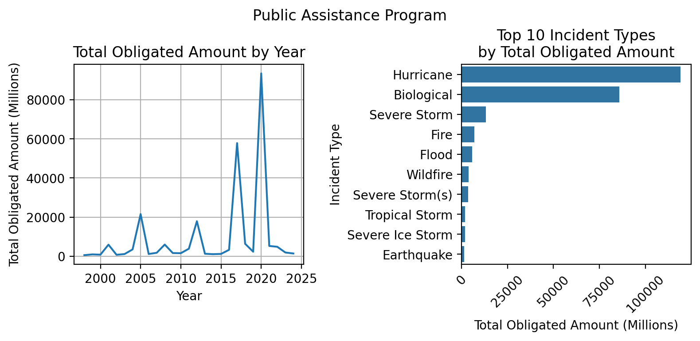
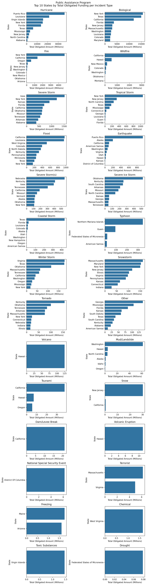

# FEMA Disaster Declarations and Public Assistance Data Analysis
Author: Mark Bauer

### Table of Contents
* [1. Introduction](#1-Introduction)  
* [2. Notebooks](#2-Notebooks)  
* [3. Data](#3-Data)  
* [4. Additional Resources](#4-Additional-Resources)  
* [5. Say Hello!](#5-Say-Hello)  

Note: This analysis uses the Federal Emergency Management Agency’s OpenFEMA API, but is not endorsed by FEMA. The Federal Government or FEMA cannot vouch for the data or analyses derived from these data after the data have been retrieved from the Agency's website(s).

Read more about OpenFEMA's [Terms and Conditions](https://www.fema.gov/about/openfema/terms-conditions).

**Table xx.** Top 20 Public Assistance Grants by Highest Total Obligated Amount (Millions)
|   rank |   disasterNumber | state          |   year | incidentType   |   totalObligatedM |
|-------:|-----------------:|:---------------|-------:|:---------------|------------------:|
|      1 |             4339 | Puerto Rico    |   2017 | Hurricane      |             33898 |
|      2 |             4480 | New York       |   2020 | Biological     |             15592 |
|      3 |             4340 | Virgin Islands |   2017 | Hurricane      |             15586 |
|      4 |             4485 | Texas          |   2020 | Biological     |             14931 |
|      5 |             4085 | New York       |   2012 | Hurricane      |             14740 |
|      6 |             1603 | Louisiana      |   2005 | Hurricane      |             13668 |
|      7 |             4482 | California     |   2020 | Biological     |             11830 |
|      8 |             1391 | New York       |   2001 | Fire           |              4733 |
|      9 |             4486 | Florida        |   2020 | Biological     |              3694 |
|     10 |             1604 | Mississippi    |   2005 | Hurricane      |              3219 |
|     11 |             4496 | Massachusetts  |   2020 | Biological     |              2999 |
|     12 |             4332 | Texas          |   2017 | Hurricane      |              2925 |
|     13 |             4488 | New Jersey     |   2020 | Biological     |              2883 |
|     14 |             4559 | Louisiana      |   2020 | Hurricane      |              2738 |
|     15 |             4611 | Louisiana      |   2021 | Hurricane      |              2639 |
|     16 |             4481 | Washington     |   2020 | Biological     |              2573 |
|     17 |             4484 | Louisiana      |   2020 | Biological     |              2495 |
|     18 |             4337 | Florida        |   2017 | Hurricane      |              2463 |
|     19 |             4086 | New Jersey     |   2012 | Hurricane      |              2243 |
|     20 |             1791 | Texas          |   2008 | Hurricane      |              2223 |

**Table xx.** Public Assistance Grants by Highest Total Obligated Amount per Incident Type (Millions)
| incidentType                    |   disasterNumber | state                          |   year |   totalObligatedM |
|:--------------------------------|-----------------:|:-------------------------------|-------:|------------------:|
| Biological                      |             4480 | New York                       |   2020 |          15592.40 |
| Chemical                        |             3366 | West Virginia                  |   2014 |              1.64 |
| Coastal Storm                   |             1379 | Texas                          |   2001 |            433.65 |
| Dam/Levee Break                 |             1529 | California                     |   2004 |             21.03 |
| Drought                         |             3276 | Federated States of Micronesia |   2007 |              0.08 |
| Earthquake                      |             4473 | Puerto Rico                    |   2020 |            947.52 |
| Fire                            |             1391 | New York                       |   2001 |           4732.56 |
| Flood                           |             4308 | California                     |   2017 |            820.38 |
| Freezing                        |             1468 | Maine                          |   2003 |              1.74 |
| Hurricane                       |             4339 | Puerto Rico                    |   2017 |          33898.10 |
| Mud/Landslide                   |             4635 | Washington                     |   2022 |             33.18 |
| National Special Security Event |             3553 | District Of Columbia           |   2021 |              6.22 |
| Other                           |             4338 | Georgia                        |   2017 |            116.01 |
| Severe Ice Storm                |             1818 | Kentucky                       |   2009 |            255.21 |
| Severe Storm                    |             1763 | Iowa                           |   2008 |           1155.49 |
| Severe Storm(s)                 |             4420 | Nebraska                       |   2019 |            508.75 |
| Snow                            |             4368 | New Jersey                     |   2018 |             30.20 |
| Snowstorm                       |             4261 | Maryland                       |   2016 |             69.27 |
| Terrorist                       |             3362 | Massachusetts                  |   2013 |              6.20 |
| Tornado                         |             4630 | Kentucky                       |   2021 |            147.52 |
| Toxic Substances                |             3603 | Virgin Islands                 |   2023 |              1.46 |
| Tropical Storm                  |             4567 | New York                       |   2020 |            780.37 |
| Tsunami                         |             1968 | California                     |   2011 |             37.70 |
| Typhoon                         |             4404 | Northern Mariana Islands       |   2018 |            281.58 |
| Volcanic Eruption               |             4201 | Hawaii                         |   2014 |             11.13 |
| Volcano                         |             4366 | Hawaii                         |   2018 |            124.89 |
| Wildfire                        |             4407 | California                     |   2018 |           1306.46 |
| Winter Storm                    |             4644 | Virginia                       |   2022 |            111.85 |

# 1. Introduction

# 2. Notebooks
- FEMA's Disaster Declarations: [disaster-declarations.ipynb](https://github.com/mebauer/fema-disaster-information/blob/main/disaster-declarations.ipynb)
- FEMA's Public Assistance Program: [public-assistance.ipynb](https://github.com/mebauer/fema-disaster-information/blob/main/public-assistance.ipynb)
- Figures in analysis: [figures.ipynb](https://github.com/mebauer/fema-disaster-information/blob/main/figures.ipynb)

# 3. Data
## OpenFEMA Dataset: Disaster Declarations Summaries - v2
Source: https://www.fema.gov/openfema-data-page/disaster-declarations-summaries-v2

Federal Emergency Management Agency (FEMA), OpenFEMA Dataset: Disaster Declarations Summaries - v2. Retrieved from https://www.fema.gov/openfema-data-page/disaster-declarations-summaries-v2. This product uses the FEMA OpenFEMA API, but is not endorsed by FEMA. The Federal Government or FEMA cannot vouch for the data or analyses derived from these data after the data have been retrieved from the Agency's website(s).

Description:  
>Disaster Declarations Summaries is a summarized dataset describing all federally declared disasters. This dataset lists all official FEMA Disaster Declarations, beginning with the first disaster declaration in 1953 and features all three disaster declaration types: major disaster, emergency, and fire management assistance. The dataset includes declared recovery programs and geographic areas (county not available before 1964; Fire Management records are considered partial due to historical nature of the dataset).

## OpenFEMA Dataset: Public Assistance Funded Projects Details - v1
Source: https://www.fema.gov/openfema-data-page/public-assistance-funded-projects-details-v1

Federal Emergency Management Agency (FEMA), OpenFEMA Dataset: Public Assistance Funded Projects Details - v1. Retrieved from https://www.fema.gov/openfema-data-page/public-assistance-funded-projects-details-v1. This product uses the FEMA OpenFEMA API, but is not endorsed by FEMA. The Federal Government or FEMA cannot vouch for the data or analyses derived from these data after the data have been retrieved from the Agency's website(s).

Description:  
>The Public Assistance Funded Projects Details dataset contains obligated (financial obligation to grantee) Public Assistance projects, lists public assistance recipients designated as applicants in the data, and a list of every funded, individual project, called project worksheets. Open projects still under pre-obligation processing are not represented. Applicant details can be obtained by relating this dataset with the OpenFEMA Public Assistance Applicants dataset using the Applicant ID field.
>
>FEMA provides supplemental Federal disaster grant assistance for debris removal, emergency protective measures, and the repair, replacement, or restoration of disaster-damaged, publicly owned facilities and the facilities of certain Private Non-Profit (PNP) organizations through the PA Program (CDFA Number 97.036). The PA Program also encourages protection of these damaged facilities from future events by providing assistance for hazard mitigation measures during the recovery process (see FEMA Hazard Mitigation Grants Sections 404 and 406: https://www.fema.gov/press-release/20230426/fema-hazard-mitigation-grants-404-and-406).

# 4. Additional Resources
- [OpenFEMA](https://www.fema.gov/about/reports-and-data/openfema): The public’s resource for FEMA program data. Promoting a culture of Open Government and increasing transparency, participation, and collaboration among the Whole Community in support of FEMA's mission to help people before, during, and after disasters.
- [The OpenFEMA API Documentation](https://www.fema.gov/about/openfema/api)
- OpenFEMA Data Visualizations:
    - [Disaster Declarations for States and Counties](https://www.fema.gov/data-visualization/disaster-declarations-states-and-counties)
    - [Public Assistance Program Summary of Obligations](https://www.fema.gov/data-visualization/public-assistance-program-summary-obligations)

# 5. Say Hello!
Feel free to reach out for further discussions.
- LinkedIn: [markebauer](https://www.linkedin.com/in/markebauer/)  
- Portfolio: [mebauer.github.io](https://mebauer.github.io/)
- GitHub: [mebauer](https://github.com/mebauer) 
